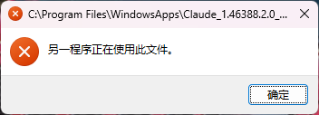
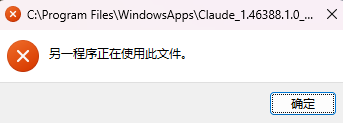
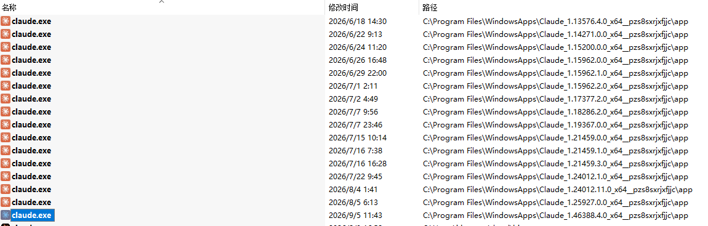
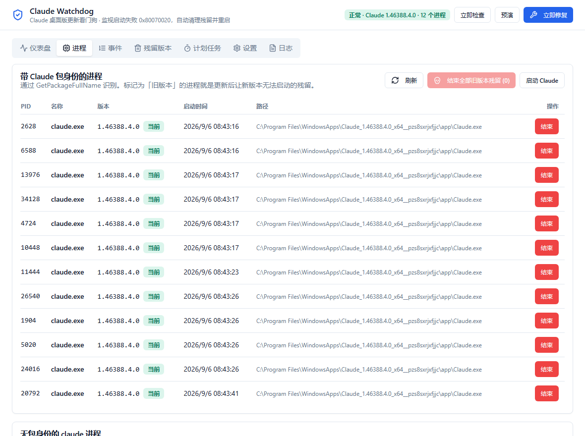
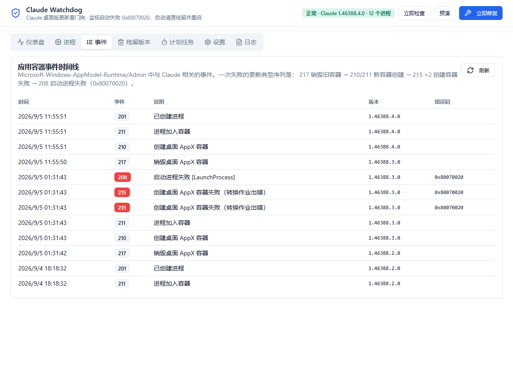
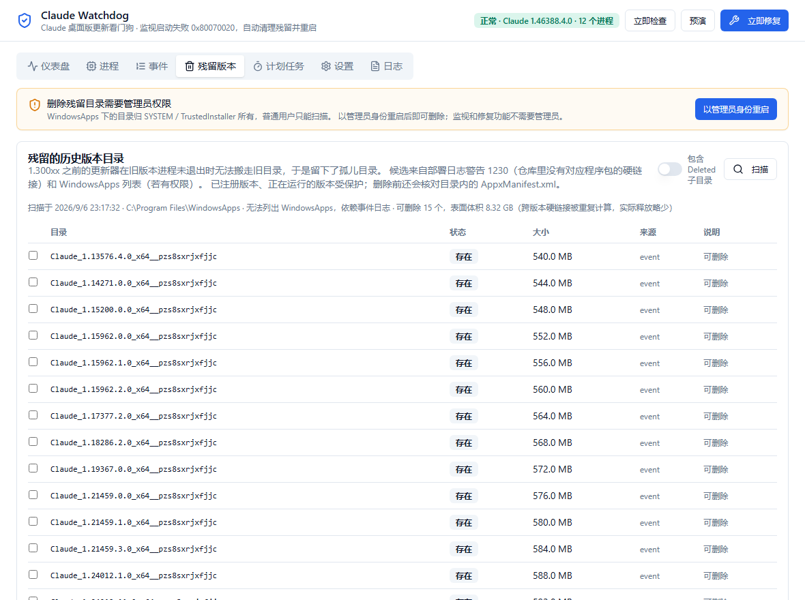

# Claude 桌面版更新看门狗

> Claude 桌面版（Windows，MSIX 包）静默自动更新后经常打不开，弹窗提示"另一程序正在使用此文件"，用户只能重启电脑。
> 这个仓库记录了排查过程、根因，以及在无法修改安装包的前提下做的两套自愈工具：PowerShell 脚本版和 Tauri 桌面版。


*桌面版主界面。检测到 Claude 启动失败（事件 208，0x80070020）后自动结束旧版本残留进程并重启 Claude，每次修复留下记录。*

- [1. 背景](#1-背景)
- [2. 现象](#2-现象)
- [3. 排查过程与证据](#3-排查过程与证据)
- [4. 根因](#4-根因)
- [5. 为什么不能直接修，只能做看门狗](#5-为什么不能直接修只能做看门狗)
- [6. 看门狗的修复原理](#6-看门狗的修复原理)
- [7. 两个实现](#7-两个实现)
- [8. 使用说明](#8-使用说明)
- [9. 历史残留版本的清理](#9-历史残留版本的清理)
- [10. 部署建议与注意事项](#10-部署建议与注意事项)
- [11. 验证情况](#11-验证情况)
- [12. 已知边界与常见问题](#12-已知边界与常见问题)
- [13. 目录结构](#13-目录结构)

---

## 1. 背景

Claude 桌面版在 Windows 上以 MSIX 包的形式安装在 `C:\Program Files\WindowsApps\Claude_<版本>_x64__pzs8sxrjxfjjc`。
它会在后台自动检查更新（每小时一次），下载好新版本后，等用户空闲一段时间，**自己悄悄退出再重启**，用户完全无感知。
2026 年 8 月底到 9 月初，更新非常频繁：10 天里推了 10 个版本，9 月 4 日一天三个。

问题是：这种静默重启经常失败。重启后 Claude 打不开，弹出"文件被占用"的错误，怎么点都没用，只有重启电脑才能恢复。
公司里多台机器、多个同事都遇到了，体验很差。这个仓库就是为了解决它。

## 2. 现象

更新后启动 Claude，出现下面的对话框。标题栏是 **新版本** 的 `Claude.exe` 路径，内容是"另一程序正在使用此文件"：





另一个相关现象：老版本的更新器不会删除历史版本目录，`WindowsApps` 下堆了 15 个旧版本的 `claude.exe`，每个 540 到 600 MB：



（截图放在 `docs/images/`，文件名见该目录下的说明。）

## 3. 排查过程与证据

在一台复现机器上（Windows 11 Pro for Workstations 26200，通过 RDP 使用）翻了三处日志，结论互相吻合。

### 3.1 Claude 自己的日志 `%LOCALAPPDATA%\Claude\logs\main.log`

每次更新都是同一套动作：

```
[updater] Found an update, downloading
[updater] Update downloaded and ready to install { releaseName: 'Claude 1.46388.3' }
[updater] Staged version 1.46388.3 is still current
[stealth-update] Triggering stealth update after idle timeout      ← 用户空闲后，App 自己触发"静默更新"
[stealth-relaunch] Saved z-order anchor ... / Saved navigation history ...
[CCD] Killing 3 PTY process tree(s) on quit
beforeQuitForUpdate handler fired, going down for update
Windows session ending (close-app) - quitting the app
<旧实例到此为止，再没有任何日志；下一行 "Starting app" 是几小时后>
```

### 3.2 Windows 部署日志 `Microsoft-Windows-AppXDeploymentServer/Operational`

部署本身是成功的，由 AppX 部署服务（AppXSvc，LocalSystem）执行：

| 事件 | 含义 |
|---|---|
| 658 | 新版本标记为"延迟注册"，因为旧版本仍在运行 |
| 603 | App 调用 `RegisterByPackageFamilyName`，选项 `ForceApplicationShutdownOption` |
| 9648 / 9650 | 打包的服务 `CoworkVMService` 被终止 |
| 400 | 注册成功 |
| 472 | 旧目录搬到 `WindowsApps\Deleted\...`，结果 0x0 |

### 3.3 应用容器日志 `Microsoft-Windows-AppModel-Runtime/Admin`

重启这一步失败了：

| 事件 | 含义 |
|---|---|
| 210 / 211 | 为新版本创建桌面 AppX 容器，加入一个进程 |
| 215 ×2（错误） | `0x80070020: 无法为程序包 Claude_<新版本> 创建桌面 AppX 容器，因为在转换作业的过程中遇到错误` |
| 208（错误） | `0x80070020: 无法创建进程 ... [LaunchProcess]` |
| 217 | **旧版本** 容器被销毁——但这条要等很久才出现 |

`0x80070020` = `ERROR_SHARING_VIOLATION`，中文提示正是"另一程序正在使用此文件"。

### 3.4 时间线

| 更新到 | App 静默退出 | 新版本启动失败（208） | 旧版本容器销毁（217） | 用户恢复可用 |
|---|---|---|---|---|
| 1.44121.4 | 09-03 14:57:52 | 14:58:28，15:25:37（用户重试） | 17:51:27 | 17:52:38 |
| 1.46388.1 | 09-04 13:30:46 | 13:30:50，15:27:22（用户重试） | 15:31:17 | 15:32:09 |
| 1.46388.2 | 09-04 18:00:58 | 18:01:00，18:10:55（用户重试） | 18:15:44 | 18:16:36 |
| 1.46388.3 | 09-05 01:31:41 | 01:31:43 | 08:32:15（**重启电脑**） | 08:43 |
| 1.46388.4 | 09-05 11:55:49 | 无 | 11:55:50 | 11:55:51（成功） |

最近 6 次静默更新失败 4 次，成功的两次说明这是竞争条件，不是必然。三天里 0x80070020 事件共 30 条。

## 4. 根因

1. App 静默退出时，**旧版本至少有一个 `claude.exe` 进程没有结束**，旧版本的桌面 AppX 容器因此还活着。
2. Windows 有条硬规则：同一个应用，旧版本容器存活期间，新版本的容器建不出来。于是新版本启动失败，报 0x80070020。
3. 残留进程没有窗口，用户看不到。直到它被结束——任务管理器、或者重启电脑——Claude 才能再打开。
4. 弹窗标题里的路径是新版本的 exe，因为失败的是新版本的启动。

责任划分：Anthropic 的 App 在 Windows MSIX 的一条硬规则上反复摔跟头。静默退出加自重启是它的设计，退出时没有确保自己所有辅助进程结束，重启失败后也没有任何重试或提示。Windows 的问题是提示语完全没指向真正原因，且不会自动清理。

顺带解释了历史版本为什么留了一堆：部署服务搬走旧目录的前提是目录里没有打开的文件，旧版本进程没退干净时搬不动，服务照样把旧包从数据库删掉，目录就留在原地成了孤儿（部署日志警告 1230 列的正是这些目录）。同一个根因的两种表现。

### 4.1 第二种表现：旧容器还在，但里面一个进程都没有（2026-09-16 补充）

1.x 升级到 2.x 那天暴露出同一根因的另一种表现，报错码一模一样，但**杀进程完全无效**。

| 时刻 | 事件 |
| --- | --- |
| 09-14 08:29:19 | 事件 210，为 `Claude_1.52386.6.0` 创建容器 `6fe0e1dd-…` |
| 09-16 01:51:23 | 升级到 `2.110.0.0`，部署每一步都返回 0x0，包状态 Ok。**上面那个容器没有被销毁** |
| 09-16 01:51 起 | 每次启动都是 215 + 208，0x80070020，持续 9 小时 25 分 |
| 09-16 11:07–11:11 | 看门狗三次修复，快照都是 `processes=0`，无进程可结束，全部失败 |
| 09-16 11:20:59 | 重启过程中才出现事件 217，销毁 `Claude_1.52386.6.0` 的容器 |
| 09-16 11:21:54 | 事件 210，`2.110.0.0` 容器创建成功，Claude 恢复 |

旧版本的容器活了两天多，扛过了整个升级，而里面没有任何带包身份的进程。Windows 那条"同一包家族不能并存两个容器"的硬规则照样生效，于是新版本永远建不出容器。

事件 215 的原文点明了失败的那一步：

```
0x80070020: 无法为程序包 Claude_2.110.0.0_x64__pzs8sxrjxfjjc 创建桌面 AppX 容器，
因为在转换作业的过程中遇到错误。
参数[2] = Claude_2.110.0.0_x64__pzs8sxrjxfjjc-S-1-5-21-…-1001
```

"转换作业"指把 Job 对象转成容器 silo，共享冲突发生在内核对象上，不是文件上。

**排查时走过的死路，不必重走**：

- 容器 Job 不在对象命名空间里。`OpenJobObject` 和 `NtOpenJobObject` 用 `<包全名>-<用户SID>` 及 `-PackagedService`、Win32 名和 `\Sessions\N\BaseNamedObjects\` 全路径，一律返回 `0xC0000034` / `ERROR_FILE_NOT_FOUND`。
- 全系统句柄枚举可行但定位不到它。`NtQuerySystemInformation(SystemExtendedHandleInformation)` 扫 20 万句柄约 56 毫秒，能拿到的有名 Job 全是 Chromium 给子进程套的沙箱作业；容器 silo 的持有者落在非管理员无法打开的进程里。另外内核对象地址对非管理员调用者是抹零的（KASLR），不提权就无法按对象聚合句柄。

### 4.2 怎么检测它

按容器 GUID 配对事件 210（创建）和 217（销毁）。两个事件都带名为 `ContainerId` 的 EventData 字段，210 还额外带 `ContainerName`。创建了却没有对应销毁的，就是仍然打开的容器；属于非当前版本的，就是阻塞者。

**按包名累加计数是错的**，这一点是实测发现的：失败循环每次都会发一条 217，却没有对应的 210，计数会被压成负数。故障时段复算出来当前版本是 **-33**，真正的阻塞者被完全掩盖。

窗口要拉得足够宽，上面那个阻塞容器比升级本身还早两天，所以状态采集一次读 1500 条原始记录。

## 5. 为什么不能直接修，只能做看门狗

- **改不了程序**。Claude 桌面版是 Anthropic 签名的 MSIX 包，改任何文件都过不了签名校验；`WindowsApps` 下的目录归 SYSTEM / TrustedInstaller 所有，普通用户和管理员都只有读权限；就算改了，下次自动更新又会覆盖。根因只能 Anthropic 修，仓库里的 `bug-report-anthropic.md` 是带完整证据的报告，可直接提交。
- **可以关掉自动更新**。Claude 支持企业托管策略，注册表 `HKLM\SOFTWARE\Policies\Claude` 下 `disableAutoUpdates` 设为 1，更新器就不再启动（[官方文档](https://support.claude.com/en/articles/12622667-enterprise-configuration)）。代价是以后要 IT 自己分发新版本，而且需要管理员权限下发。
- **所以做看门狗**。既然失败的每一步 Windows 都写进了事件日志，那就在失败发生的那一刻自动做用户本来要手动做的事：结束残留进程、重新启动 Claude。这不改动 Claude 的任何文件，不需要管理员，用户最多看到一次弹窗，几秒后 Claude 自己回来了。

三条路可以同时用。看门狗解决当下，策略把主动权交给 IT，报告推动 Anthropic 修根因。

## 6. 看门狗的修复原理

```
事件日志 AppModel-Runtime/Admin 出现 208（ApplicationName = Claude_pzs8sxrjxfjjc!Claude，ErrorCode = 0x80070020）
        │  推送订阅（EvtSubscribe，毫秒级）或轮询兜底
        ▼
等 3 秒让失败的启动过程完全退出
        ▼
枚举所有带 Claude 包身份的进程（GetPackageFullName），记录到日志
        ▼
结束它们（新旧版本都结束，卡住的新版本主进程也要清）
        ▼
等进程全部消失（最长 20 秒），再等 2 秒让容器销毁
        ▼
通过 AUMID shell:AppsFolder\Claude_pzs8sxrjxfjjc!Claude 重新启动 Claude
        ▼
25 秒内确认新版本进程出现；失败重试一次；记录结果并通知
```

### 6.1 容器级故障的补救阶梯（0.3.0 起）

上面那条流水线只对"有残留进程"的那一类有效。当快照里**一个可结束的进程都没有**（4.1 那一类）时，桌面版会判定为容器级故障，直接说明杀进程无效并点出是哪个旧版本的容器堵着，不再做两次注定失败的重启尝试，然后按阶梯补救：

| 步骤 | 做什么 | 默认 | 说明 |
| --- | --- | --- | --- |
| 1 | 正常重新启动一次 | 开 | 偶发竞争这一步就过了 |
| 2 | 重启 AppX 部署服务 `AppXSvc` | 开 | 它独占一个 svchost（`-k wsappx -p`），`CanStop=True`，重启只影响自己；被连带停掉的依赖服务会被拉回来。需要管理员 |
| 3 | `Add-AppxPackage -Register` 重新注册程序包 | **关** | 只重建当前用户的注册信息，**不会删除登录、会话、设置**（它不是会清空数据的 `Reset-AppxPackage`）。默认关闭是因为万一中途失败，程序包可能处于未注册状态 |
| 4 | 如实报告需要注销或重启 | — | 带上阻塞的旧版本号 |

> **步骤 2、3 尚未在真实故障中验证过。** 它们的依据是 AppXSvc 掌管容器生命周期，推断成立但没有实测。到目前为止，唯一被证实能解开卡住容器的仍然是**重启电脑**。下次真的再遇到，日志会记下每一步的结果。

安全设计：

- **只动带 Claude 包身份的进程**。Claude Code 命令行、它派生的终端、MCP 服务器、开发服务器都没有包身份，不在容器里，不会被结束。
- **只在 0x80070020 时动手**。其它错误码只记录。
- **频率限制**：15 分钟内最多 3 次，避免修复失败时死循环。
- **单飞**：同一时刻只跑一个修复。
- **同一个事件只处理一次**（按 EventRecordID 去重），订阅和轮询不会重复处理。
- **触发时 Claude 已经不可用**，结束进程不会造成额外损失。

## 7. 两个实现

| | `scripts/` 脚本版 | `desktop/` 桌面版 |
|---|---|---|
| 形态 | PowerShell 脚本 + 计划任务 | Tauri 2 + Rust + React 桌面程序，常驻托盘 |
| 依赖 | 无 | 安装包自带 WebView2 引导 |
| 触发 | 计划任务订阅事件 208 | 进程内 EvtSubscribe 推送 + 轮询 + 同样的计划任务兜底 |
| 可视化 | 无，看日志 | 仪表盘、进程、事件时间线、残留清理、计划任务、设置、日志 |
| 适合 | 批量推给同事，一条命令装好 | 需要看清发生了什么、手动处置、清理残留 |

两者可并存：桌面版安装的计划任务会覆盖同名的脚本版任务，把兜底动作换成 `claude-watchdog.exe --repair-from-event`。

桌面版的架构借鉴了同作者的 ip-killswitch（Tauri 2 + Rust 后端模块化，React + zustand + shadcn 风格组件，托盘多态图标，单实例，随机端口 dev 脚本），只保留看门狗需要的部分。

## 8. 使用说明

### 8.1 脚本版（`scripts/`）

安装到当前用户，不需要管理员：

```powershell
powershell -NoProfile -ExecutionPolicy Bypass -File .\scripts\Install-ClaudeUpdateWatchdog.ps1
```

安装脚本结束时会把任务跑一次自检，看到 `Self-test result: LastTaskResult = 0x00000000 (OK)` 即成功。
脚本和日志在 `%USERPROFILE%\ClaudeUpdateWatchdog\`。日常：

```powershell
.\scripts\Claude-UpdateWatchdog.ps1 -Status          # 看状态：注册版本、带包身份的进程、是否有残留
.\scripts\Claude-UpdateWatchdog.ps1 -Force -DryRun   # 预演一次修复
.\scripts\Claude-UpdateWatchdog.ps1 -Force           # 手动修复（在普通 PowerShell 里跑，别在 Claude 内置终端里跑）
powershell -NoProfile -ExecutionPolicy Bypass -File .\scripts\Uninstall-ClaudeUpdateWatchdog.ps1   # 卸载
```

细节见 `scripts/README.md`。

### 8.2 桌面版（`desktop/`）

安装：从 GitHub Releases 下载 `Claude Watchdog_<版本>_x64-setup.exe`（按用户安装，不需要管理员），本地构建时产物在
`desktop/src-tauri/target/release/bundle/nsis/`。安装包不入库，构建与发布见 8.4 和 `desktop/README.md`。

界面（主界面见文首截图）：

| 页签 | 内容 |
|---|---|
| 仪表盘 | 健康状态、已注册版本、进程数、旧版本残留数、最近启动失败、修复记录、官方策略是否生效 |
| 进程 | 带 Claude 包身份的进程，旧版本标红，可单个或批量结束；无包身份的 claude 进程单独列出 |
| 事件 | 容器事件时间线（201/208/210/211/215/217），直接看到失败序列 |
| 残留版本 | 扫描并删除 WindowsApps 下的孤儿目录，删除需管理员，界面提供 UAC 重启 |
| 计划任务 | 安装/卸载/自检兜底任务，GUI 不在运行时也能修 |
| 设置 | 自动修复、修复延迟、失败有效期、频率限制、通知、轮询间隔、自启动、关闭到托盘、退出确认、日志等级 |
| 日志 | 运行日志尾部，每次修复的进程清单都在这里 |

|  |  |
|---|---|
| 进程页：带 Claude 包身份的进程，旧版本残留会标红 | 事件页：容器事件时间线，能直接看到 217 → 210/211 → 215 ×2 → 208 的失败序列 |



*残留版本页：扫描 WindowsApps 下的孤儿目录，勾选后删除，受保护项不可选。*

托盘图标：灰 = 暂停或未检查，绿 = 正常，琥珀 = 有旧版本残留，红 = 检测到失败或修复中。
右键菜单：显示主窗口 / 立即检查 / 立即修复 / 暂停·恢复监视 / 退出。

推荐设置：打开「登录时自动启动」（静默到托盘），并在「计划任务」页安装兜底任务。

命令行模式（计划任务和脚本化用）：

```text
claude-watchdog.exe --check [--out <文件>]              输出当前状态 JSON
claude-watchdog.exe --repair [--dry-run] [--out <文件>] 手动修复 / 预演，输出记录 JSON
claude-watchdog.exe --repair-from-event [--out <文件>]  计划任务用：最近 5 分钟内有 208/0x80070020 才动手
claude-watchdog.exe --minimized                        GUI 静默启动到托盘
```

退出码：0 成功或无事可做，1 修复失败，2 触发频率限制。脚本里取 JSON 请用 `--out` 写文件，
因为 release 版是 GUI 子系统程序，PowerShell 不会等待它结束。

数据位置：配置 `%APPDATA%\io.github.itbaymax.claudewatchdog\config.json`，修复历史同目录 `history.json`，
日志 `%LOCALAPPDATA%\io.github.itbaymax.claudewatchdog\logs\`。

开发与构建见 `desktop/README.md`。

### 8.3 关于"从看门狗打开 Claude Code 会话"（已移除）

0.1.2 到 0.1.3 曾加入过这个入口，0.1.4 已移除，原因是它达不到真正想要的两件事，记在这里避免重复踩坑：

- **独立 CLI 不能免登录。** 每个请求都必须带凭证。最接近的官方做法是 `claude setup-token` 生成一年期令牌放进 `CLAUDE_CODE_OAUTH_TOKEN`，
  或者用 Console 的 API Key，两者都还是一次授权。
- **Desktop 的登录不能桥接给外部 CLI。** Desktop 的令牌只在它自己进程内通过 SDK 通道供给内置引擎（Code 标签页），
  不落盘、不进环境变量；Anthropic 的条款明确禁止其它程序收集或中转 Claude.ai 的凭证与会话令牌
  （[Legal and compliance](https://code.claude.com/docs/en/legal-and-compliance)）。
- Desktop 确实提供 `claude://code/new?folder=…` 这样的深链接给系统跳转列表用，也能从外部触发，但在 Desktop 里开会话直接点 Code 标签页更快，
  这个入口没有实际价值。
- 跨设备实时访问同一个会话是官方的 **Remote Control**（[文档](https://code.claude.com/docs/en/remote-control)），
  Team / Enterprise 需要组织 Owner 在 <https://claude.ai/admin-settings/claude-code> 开启；本机组织当前为 `org_denied`。

### 8.4 发布与应用内更新（GitHub Actions）

- **构建**：只出 Windows x64 安装包，macOS / Linux 不需要这个看门狗。`.github/workflows/release.yml`：
  推送 `v*` 标签 → 在 `windows-latest` 上 `npm ci`、按标签同步三处版本号、`tauri-action` 构建带签名的 NSIS 安装包和 `latest.json`，
  挂到一个草稿 Release 上，审核后 Publish。手动触发（workflow_dispatch）只构建、把安装包作为 Artifact 上传，不建 Release。
- **签名**：本项目独立的一对 minisign 密钥（`npx tauri signer generate -w tauri-signing-key.key` 生成），公钥写在
  `desktop/src-tauri/tauri.conf.json` 的 `plugins.updater.pubkey`，私钥和密码放在仓库 Secrets：`TAURI_SIGNING_PRIVATE_KEY`、`TAURI_SIGNING_PRIVATE_KEY_PASSWORD`。
  私钥文件不入库；请另行备份，丢失后无法再给已安装的用户推送更新。
- **应用内更新**：桌面版 设置 → 关于与更新，启动后 6 小时内静默检查一次，也可手动检查。更新源是
  `https://github.com/ItBayMax/claude-update-watchdog/releases/latest/download/latest.json`，如果仓库名不是 `claude-update-watchdog`，改 `plugins.updater.endpoints` 这一行。
- **本地打包**：没有私钥时用 `npm run tauri:build:local`，它通过 `tauri.local.conf.json` 关掉更新包签名；`npm run tauri:build` 需要设置 `TAURI_SIGNING_PRIVATE_KEY`。

发一个版本：

```bash
git tag v0.2.0
```

```bash
git push origin v0.2.0
```

### 8.5 官方策略（可选，IT 接管更新节奏）

```
HKLM\SOFTWARE\Policies\Claude
    disableAutoUpdates    REG_DWORD    1
```

生效于 Claude 下次启动。如果下发时 Claude 正在运行且已下载好一个更新，那一个仍会安装一次。
桌面版仪表盘会显示该策略当前状态。

## 9. 历史残留版本的清理

15 个孤儿目录约 8 GB。它们已经不在 AppX 仓库里，`Remove-AppxPackage` 删不掉，只能以管理员身份接管所有权后删除。
两种方式：

- 脚本：先 `.\scripts\Remove-StaleClaudePackages.ps1` 出报告，确认后在管理员 PowerShell 里加 `-Delete`。
- 桌面版：「残留版本」页扫描，勾选，删除（需管理员，界面可一键 UAC 重启）。

安全规则相同：只认 `Claude_<版本>_x64__pzs8sxrjxfjjc` 目录；已注册版本、正在运行的版本受保护；删前核对目录内 `AppxManifest.xml`；
只改这些目录自身的权限，不碰 `WindowsApps` 根目录。

用户数据不在这里：登录令牌、会话、配置在 `%APPDATA%\Claude` 和 `%LOCALAPPDATA%\Packages\Claude_pzs8sxrjxfjjc`，
Claude Code 的会话在 `%USERPROFILE%\.claude`。删旧版本目录不会导致重新登录。

## 10. 部署建议与注意事项

1. **先在一台机器上装脚本版或桌面版，等一次真实更新，看日志确认自愈发生**，再推全员。
2. 按用户安装即可，不需要管理员。全员一次性安装的 `-AllUsers` 路径没有实测过。
3. **不要在 Claude 桌面版内置的终端里安装或运行**。那个终端跑在 Claude 的 MSIX 容器里，往 AppData 写的文件会被文件系统虚拟化
   重定向到 `Packages\Claude_pzs8sxrjxfjjc\LocalCache`，容器外的计划任务看不到，任务会以 0xFFFD0000（找不到脚本）失败；
   `claude-cli://` 深链接从容器里发起也不会有任何反应。脚本版因此故意把文件放在 `%USERPROFILE%\ClaudeUpdateWatchdog`。
4. 下班或离开前手动完全退出 Claude 能减少静默更新的机会，但不能完全避免，看门狗才是兜底。
5. 建议同时把 `bug-report-anthropic.md` 提交给 Anthropic（桌面版 Help → Report a bug，或 support.claude.com）。

## 11. 验证情况

2026-09-05 在复现机器上：

- 触发过滤器回放历史事件，精确命中过去全部 10 次失败。
- 脚本版：安装脚本自检通过（任务返回 0），任务环境下预演正确列出 11 个 Claude 进程并排除 Claude Code 命令行进程。
- 桌面版：`tsc` 与 `cargo check` 零错误零警告；`--check` 正确读出已注册版本 1.46388.4.0、13 个带包身份的进程、
  1 个无包身份的 claude 进程、40 条容器事件、上一次失败（01:31:43，0x80070020，1.46388.3.0）和计划任务状态；
  `--repair --dry-run` 列出 13 个将被结束的进程；`--repair-from-event` 在无失败时以 0 退出；
  GUI 启动后窗口正常、日志显示"subscribed to launch-failure events"和"scheduler started"，退出干净。
- 真实触发只能等下一次更新失败，日志和修复记录会留下完整证据。真正的 `--repair` 没有在这台机器上执行过，因为它会结束正在承载本次开发会话的 Claude。
- 2026-09-06：手动修复实测成功（结束 11 个进程并重启 Claude 1.46388.4.0）；「启动 CLI」的深链接从容器外实测成功，Windows Terminal 新开标签运行 Claude Code，目录和提示词按参数预填。

2026-09-16，1.x 升级到 2.110.0.0 当天：

- **看门狗对这次故障无效**，如实记录在案。三次修复的快照都是 `processes=0`，没有可结束的进程，两次重启尝试均失败，最终只有重启电脑解决。原因见 4.1。
- 容器配对检测已验证：Rust 实现（`--check` 的 `open_containers`）输出的容器 GUID 与独立用 PowerShell 复算事件日志的结果**逐字一致**。把窗口回放到故障时刻（11:17），该算法能准确报出 `Claude_1.52386.6.0` 是阻塞者。
- 按包名计数的做法在验证中被证伪并废弃，详见 4.2。
- 0.3.0 的故障分类与消息文案已通过编译与 `--check` 冒烟测试；**补救阶梯的第 2、3 步没有在真实故障中跑过**。

## 12. 已知边界与常见问题

**它会不会误杀 Claude Code 或我的开发服务器？** 不会。只结束带 Claude 包身份的进程；命令行和它派生的进程没有包身份。

**修复的时候 Claude 里没保存的东西会丢吗？** 触发修复时新版本已经启动失败、旧版本已经退出，不存在可丢的状态；界面恢复靠 Claude 自己的会话持久化。

**为什么弹窗还是会闪一下？** 弹窗是 Windows 在启动失败时弹的，看门狗在它出现后几秒内才能行动。

**只处理 0x80070020 吗？** 是。其它启动失败原因不同，不应该用结束进程的方式处理。

**日志里出现「拒绝访问（受保护进程）」是怎么回事？** 以管理员运行 0.1.0 时会看到。那是 `cowork-svc.exe`，Claude 打包的 Windows 服务
CoworkVMService，以 SYSTEM 身份跑在会话 0，也带 Claude 包身份，但结束一个 SYSTEM 服务连管理员也没权限。它不属于用户的应用容器，
不影响修复，更新时由 Windows 部署服务自行终止。0.1.1 起只处置当前会话的进程，服务单独列出、永不处置。

**图标太丑。** 是占位图，`npx @tauri-apps/cli icon <源图.png>` 可替换。

## 13. 目录结构

```
claude-update-watchdog/
├── README.md                     本文
├── bug-report-anthropic.md       给 Anthropic 的英文报告
├── docs/images/                  截图
├── scripts/                      脚本版
│   ├── Claude-UpdateWatchdog.ps1
│   ├── Install-ClaudeUpdateWatchdog.ps1
│   ├── Uninstall-ClaudeUpdateWatchdog.ps1
│   ├── Remove-StaleClaudePackages.ps1
│   └── README.md
└── desktop/                      桌面版（Tauri 2 + Rust + React）
    ├── src/                      前端
    ├── src-tauri/                后端
    └── README.md
```
