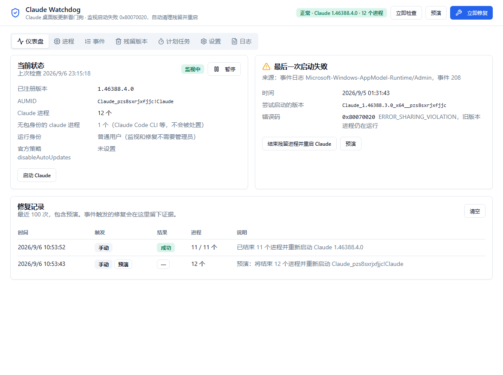

# Claude Watchdog（桌面版）



Claude 桌面版更新看门狗的可视化版本。常驻托盘，订阅 Windows 事件日志，检测到 Claude 启动失败
（事件 208，0x80070020）后自动结束旧版本残留进程并重新启动 Claude；同时提供进程视图、
容器事件时间线、残留历史版本清理和计划任务兜底。仅支持 Windows。

架构借鉴同作者的 ip-killswitch：Tauri 2 + Rust 后端，React 18 + Vite 5 + Tailwind 3 + shadcn 风格组件，
zustand 状态，托盘多态图标，单实例，随机端口 dev 脚本。

## 功能

- **仪表盘**：健康状态、已注册版本、Claude 进程数、旧版本残留数、最近启动失败、修复记录、官方策略状态。
- **进程**：所有带 Claude 包身份的进程（`GetPackageFullName`），旧版本标红，可单个或批量结束；无包身份的 claude 进程单独列出且永不处置。
- **事件**：`Microsoft-Windows-AppModel-Runtime/Admin` 中 201/208/210/211/215/217 事件时间线，直接看到失败序列。
- **残留版本**：扫描 `WindowsApps` 下的孤儿目录（来源：部署日志警告 1230 + 目录列表），受保护项不可选；删除需管理员，提供 UAC 重启。
- **计划任务**：安装/卸载/自检兜底任务，动作为 `claude-watchdog.exe --repair-from-event`，即使 GUI 不在运行也能修。
- **设置**：自动修复开关、修复延迟、失败有效期、15 分钟内最多次数、通知、轮询间隔、自启动、关闭到托盘、退出确认、日志等级。
- **托盘**：灰 = 暂停/未检查，绿 = 正常，琥珀 = 有旧版本残留，红 = 检测到失败或修复中。菜单可立即检查、立即修复、暂停/恢复。

## 修复流水线

1. 单飞保护 + 频率限制（15 分钟内最多 N 次）。
2. 快照：已注册版本（注册表 AppModel Repository）、带包身份的进程。
3. 结束全部带 Claude 包身份的进程（新旧版本都算，卡住的新版本主进程也要清）。
4. 轮询等待进程全部消失（最长 20 秒），再等 2 秒让容器销毁。
5. 通过 `shell:AppsFolder\Claude_pzs8sxrjxfjjc!Claude` 重新启动，25 秒内确认新版本进程出现，失败重试一次。
6. 写入修复记录（`history.json`）、系统通知、托盘刷新。

事件到达有两条路：`EvtSubscribe` 推送（毫秒级）和轮询兜底（`poll_seconds`）。同一个 EventRecordID 只处理一次。

## 命令行模式

```text
claude-watchdog.exe --check [--out <文件>]              输出当前状态 JSON
claude-watchdog.exe --repair [--dry-run] [--out <文件>] 手动修复 / 预演，输出记录 JSON
claude-watchdog.exe --repair-from-event [--out <文件>]  计划任务用：最近 5 分钟内有 208/0x80070020 才动手
claude-watchdog.exe --minimized                        GUI 静默启动到托盘（自启动用）
```

退出码：0 成功或无事可做，1 修复失败，2 触发频率限制。

release 版是 GUI 子系统程序：交互式终端里直接运行能看到输出，但 PowerShell 不会等它结束，
`$x = & claude-watchdog.exe --check` 这种写法拿不到结果还可能卡住进程。脚本里请用 `--out` 写文件，或者：

```powershell
Start-Process claude-watchdog.exe -ArgumentList '--check' -Wait -NoNewWindow -RedirectStandardOutput status.json
```

输出是 UTF-8（无 BOM），Windows PowerShell 5.1 读取时请加 `-Encoding UTF8`，否则中文字段会显示成乱码：

```powershell
Get-Content status.json -Raw -Encoding UTF8 | ConvertFrom-Json
```

## 开发与构建

```bash
npm install
npm run gen:icons           # 生成占位图标（首次）
npm run tauri:dev           # 随机端口 Vite + Tauri，热更新
npm run tauri:build:local   # 本地打包，不签名更新包：src-tauri/target/release/claude-watchdog.exe 与 bundle/nsis/*-setup.exe
npm run tauri:build         # 正式打包，需要 TAURI_SIGNING_PRIVATE_KEY（CI 用）
```

**发布与自动更新。** 推送 `v*` 标签后 `.github/workflows/release.yml` 在 Windows 上构建带签名的 NSIS 安装包和 `latest.json`，挂到草稿 Release。
应用内「设置 → 关于与更新」通过 `tauri-plugin-updater` 从 `plugins.updater.endpoints` 拉取 `latest.json`，用 `pubkey` 校验签名后下载安装并重启。
密钥对为本项目独立生成，私钥与密码存在仓库 Secrets `TAURI_SIGNING_PRIVATE_KEY` / `TAURI_SIGNING_PRIVATE_KEY_PASSWORD`，私钥文件不入库。
`tauri.local.conf.json` 只关掉 `createUpdaterArtifacts`，让没有私钥的机器也能打包。

`cargo check` 需要先 `npx vite build` 生成 `dist/`（tauri-build 在编译期打包前端）。

**演示模式。** 前端检测不到 Tauri 运行时（`window.__TAURI_INTERNALS__`）时，`src/api.ts` 自动改用 `src/mock.ts` 的示例数据并显示一条"演示模式"横幅，
所以直接 `npm run dev` 在浏览器里打开 `http://127.0.0.1:1420/` 就能看到完整界面，用于调样式和截图。
`?screenshot=1` 隐藏横幅，`?tab=processes|events|stale|task|settings|logs` 预选页签。桌面程序内永远走真实的 `invoke`，演示代码不会被触发。截图流程见 `../docs/images/README.md`。

## 目录

```
desktop/
├── package.json / vite.config.ts / tailwind.config.js / tsconfig*.json / index.html
├── scripts/            dev-server.js（随机端口）、tauri-cli.mjs、gen-icons.mjs
├── src/                React 前端
│   ├── App.tsx / main.tsx / api.ts / store.ts / types.ts / index.css
│   ├── components/     Dashboard / ProcessesPanel / EventsPanel / StalePanel / TaskPanel / SettingsPanel / LogsPanel / 对话框
│   └── components/ui/  button / badge / card / dialog / input / label / switch / tabs / textarea
└── src-tauri/          Rust 后端
    ├── Cargo.toml / tauri.conf.json / capabilities/default.json / icons/
    └── src/
        ├── lib.rs        Builder + 插件 + setup
        ├── cli.rs        无界面模式
        ├── commands.rs   invoke 处理器
        ├── config.rs     JSON 配置
        ├── state.rs      AppState、修复历史持久化
        ├── model.rs      与 src/types.ts 对齐的 serde 结构
        ├── packages.rs   注册表读已注册包、GetPackageFullName、kill、AUMID 启动、策略读取
        ├── eventlog.rs   EvtQuery / EvtSubscribe + XML 解析
        ├── status.rs     一次完整快照
        ├── repair.rs     修复流水线 + 事件反应
        ├── stale.rs      残留目录扫描/删除
        ├── task.rs       计划任务（PowerShell ScheduledTasks 模块）
        ├── scheduler.rs  轮询
        ├── watcher.rs    事件订阅线程
        ├── tray.rs       托盘
        ├── admin.rs      提权
        └── logger.rs     tracing 日滚动文件
```

## 数据位置

| 内容 | 路径 |
|---|---|
| 配置 | `%APPDATA%\io.github.itbaymax.claudewatchdog\config.json` |
| 修复历史 | `%APPDATA%\io.github.itbaymax.claudewatchdog\history.json` |
| 日志 | `%LOCALAPPDATA%\io.github.itbaymax.claudewatchdog\logs\claude-watchdog.log.<日期>` |

注意：不要在 Claude 桌面版内置终端里安装或首次运行本程序。那个终端跑在 Claude 的 MSIX 容器里，
AppData 下的写入会被重定向到 `Packages\Claude_pzs8sxrjxfjjc\LocalCache`，计划任务在容器外看不到。

## 构建与实测记录（2026-09-05）

| 项目 | 结果 |
|---|---|
| `npx tsc -b` / `npx vite build` | 通过，产物 270 KB JS + 21 KB CSS |
| `cargo check` | 零错误零警告（首次全量 51 秒，依赖命中 ip-check 的下载缓存） |
| `--check` | 1.4 秒返回 JSON：health=healthy，current=1.46388.4.0，processes=13，orphans=0，events=40，task.installed=true |
| `--repair --dry-run` | planned=13，target=1.46388.4.0，success=true |
| `--repair-from-event` | 最近 5 分钟无失败 → 记录 "nothing to do"，退出码 0 |
| GUI（debug，经 explorer 启动） | 窗口标题正确，配置目录创建，日志出现 `subscribed to launch-failure events`、`scheduler started: every 5s`、`event watcher running`，Stop-Process 后干净退出 |
| release `--check`（Start-Process -Wait 重定向） | 2.3 秒，退出码 0，stdout 与 `--out` 文件内容一致 |
| `npm run tauri:build` | 通过，产物 `bundle/nsis/Claude Watchdog_0.1.0_x64-setup.exe`（4.6 MB，按用户安装）与免安装 `release/claude-watchdog.exe` |
| 真实 `--repair` | 未在开发机上执行：会结束承载开发会话的 Claude |
| 0.1.2 `--cli-info` | CLI `%USERPROFILE%\.local\bin\claude.exe` 2.1.220，处理器已注册，凭证缓存存在，Windows Terminal 可用 |
| 0.1.2 深链接实测（2026-09-06 13:40） | 从容器外（临时计划任务）打开 `claude-cli://open?cwd=…&q=…`：Windows Terminal 新开一个标签运行 `claude.exe --deep-link-origin --deep-link-cwd-b64=… --prefill-b64=…`，目录与提示词按参数预填。从 Claude 桌面版内置终端里发起同样的链接什么都不会发生，这是 MSIX 容器的限制，安装后的看门狗不受影响 |

## 变更记录

- **0.2.0**（2026-09-07）：接入 `tauri-plugin-updater`，设置页新增「关于与更新」；`tauri.conf.json` 配置 GitHub Releases 更新源与本项目的签名公钥；
  新增 `.github/workflows/release.yml`（仅 Windows x64）与 `npm run tauri:build:local`。
- **0.1.4**（2026-09-06）：新增浏览器演示模式（非 Tauri 环境自动使用 `src/mock.ts` 示例数据；`?screenshot=1`、`?tab=` 参数），用于文档截图；桌面程序行为不变。移除「启动会话」页及相关代码（`launcher.rs`、`--cli-info`、`percent-encoding` 依赖、`dialog:allow-open` 权限）。
  它达不到真正的目标：独立 CLI 无法免登录，每个请求都要带凭证；Desktop 的登录也不能桥接给外部 CLI，令牌只在 Desktop 进程内经 SDK 通道供给内置引擎，
  条款禁止其它程序收集或中转。要在 Desktop 里开会话，直接点 Code 标签页更快。看门狗回到只做更新失败自愈这件事。
- **0.1.3**（2026-09-06）：「启动会话」页新增 Desktop 内置引擎入口：`claude://code/new?folder=…&q=…&source=claude_watchdog` 与
  `claude://code/continue?session=last`，这是 Desktop 自己给跳转列表 / Spotlight / `ccd` 别名用的路由（读 `folder`、`q`/`prompt`、`file`、`source`）。
  新增 Remote Control 判定显示（读 Desktop main.log 尾部的 `[rcAutoEnable] verdict`）。`--cli-info` 增加 `desktop_protocol_registered`、`remote_control_hint`。
- **0.1.2**（2026-09-06）：新增「启动 CLI」页。通过官方文档的 `claude-cli://open` 深链接（[Launch sessions from links](https://code.claude.com/docs/en/deep-links)）在新终端里打开 Claude Code，
  支持工作目录 / GitHub 仓库 slug / 预填提示词；处理器未注册时可直接在 Windows Terminal 或 PowerShell 里启动 CLI。新增 `--cli-info` 命令行模式。
  依赖 `dialog:allow-open` 权限（选择文件夹）和 `percent-encoding`。
- **0.1.1**（2026-09-06）：进程快照按 Windows 会话过滤。带包身份但不在当前会话的进程（会话 0 的 CoworkVMService `cowork-svc.exe`、其他用户的 Claude）
  单独列为"打包服务 / 其他会话"，修复不再尝试结束它们，也不再为它们等待 20 秒。此前以管理员运行时会出现"拒绝访问（受保护进程）"和 11/12 的计数。
- **0.1.0**（2026-09-05）：首个版本。

## 已知边界

- 只处理 0x80070020 这一类启动失败，其它错误码只记录不动手。
- 图标是占位的纯色圆盘，替换用 `npx @tauri-apps/cli icon <源图.png>`。
- 应用内更新依赖 GitHub Releases 可达；内网机器访问不了 github.com 时，「检查更新」会报错，手动安装新版即可。
